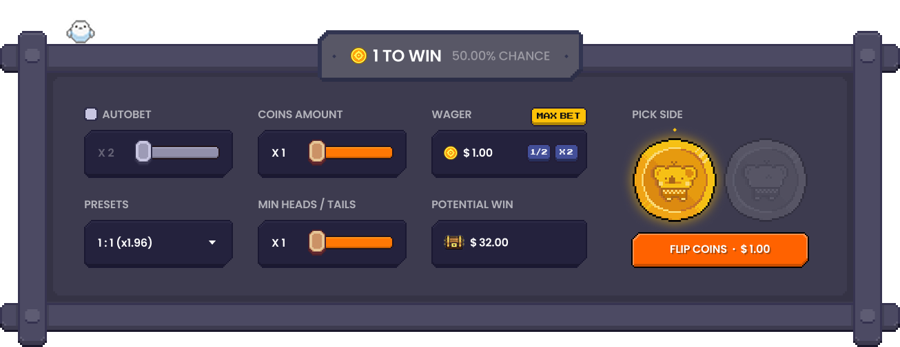

# Coin Flip Game Rules

## Game Objective

The objective of the Coin Flip game is to correctly predict the outcome of a coin flip. Players bet on heads or tails and win 2x their bet amount for correct predictions.

## How to Play

1. Set your bet amount (1-100 dollars)

   - Adjust with a portion slider of your available balance
   - Use X2 or X0.5 buttons inside the betting input to quickly adjust your bet

2. Select either HEADS or TAILS as your prediction
3. Click the FLIP button to start the game
4. Watch the coin animation for 2 seconds to see the result
5. Winnings are automatically added to your balance if successful

## Game Mechanics

- Starting balance: 100 dollars (will be retrieved from backend server in production)
- Minimum bet: 1 dollar
- Maximum bet: Limited to your current balance
- Payout ratio: 2:1 (win double your bet)
- Multiple coin mode:
  - Select 1-10 coins to flip simultaneously
  - Specify minimum heads count required (1-10)
  - Payout calculated based on probability (house edge: 4%):
    - 1 coin, heads: 1.96x (50% probability)
    - 5 coins, 3+ heads: 1.96x (50% probability)
    - 10 coins, 8+ heads: 17.45x (5.5% probability)

## UI Elements

- Coin display:
  - Single mode: One 120px yellow circle coin with coin_front.png and coin_back.png
  - Multiple mode: Grid of 1-10 coins (60px each) arranged in up to 2 rows
  - Heads: coin_front.png
  - Tails: coin_back.png
- Balance display: Top-right corner showing "Balance: X FCT"
- Bet controls:
  
  - First Row
    - AUTOBET: Enables automatic repeated betting
    - COINAMOUNT: Slider from 0.0x to 1.0x to adjust betting proportion
    - WAGER: Betting amount input with 0.5x and 2x quick adjustment buttons
  - Second Row
    - PRESETS: Quick selection options (1:1 (x1.96), 1:10 (x983.04), etc.)
    - MIN HEADS/TAILS: Minimum required heads or tails count for winning
    - POTENTIAL WIN: Calculated potential earnings display based on current settings
- Side selection:
  - HEADS button: coin_front.png (disabled state: coin_front_deselect.png)
  - TAILS button: coin_back.png (disabled state: coin_back_deselect.png)
- FLIP button: Initiates the coin flip

## Game Features

- Animation settings:
  - Toggle on/off via bottom button
- Auto-flip mode:
  - Initiates continuous flipping at 3-second intervals
  - Stops when user clicks "Stop" button
  - Automatically stops if balance falls below bet amount
  - Maximum 100 consecutive flips
- Session statistics:
  - Win/loss ratio
  - Total amount won/lost
  - Longest win/loss streak
  - Updated in real-time after each flip

## Technical Specifications

- Random number generation: Cryptographically secure PRNG
- Minimum balance to play: 0.01 dollar
- Maximum single bet: 100 dollars
- Betting lockout: Betting disabled during coin flip animation
