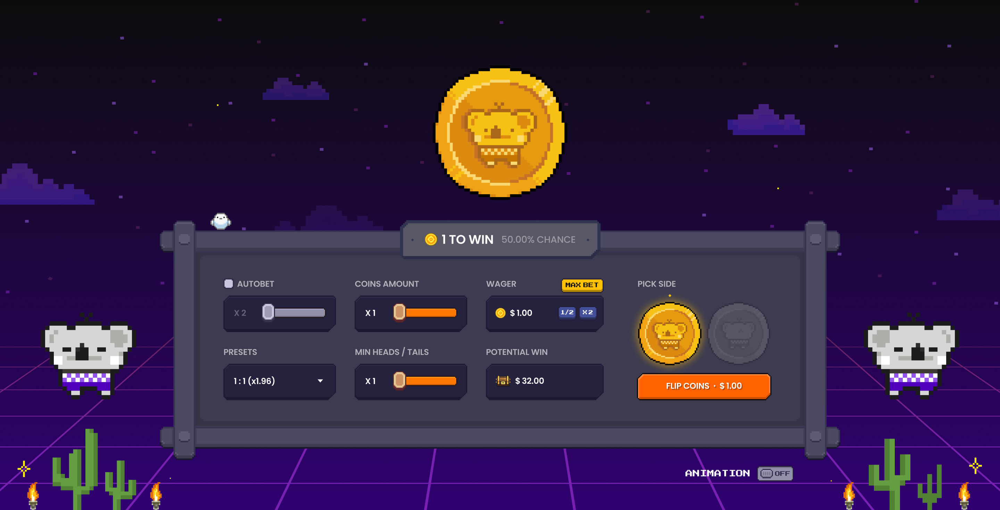
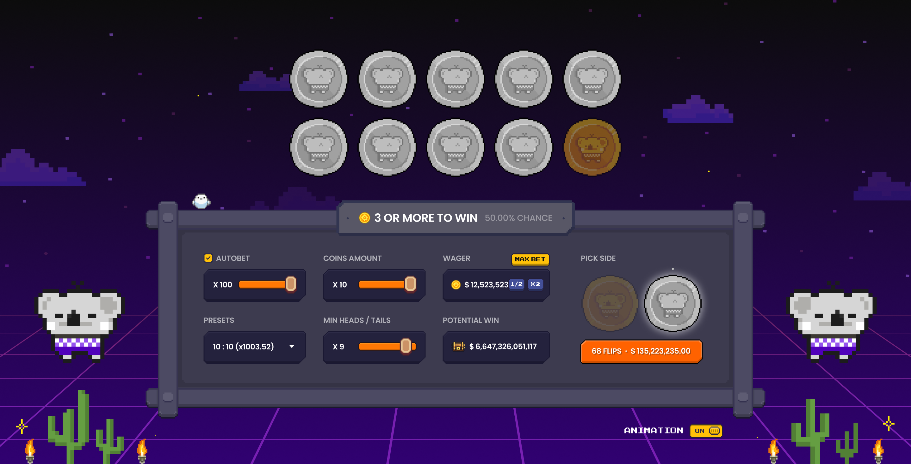

# Coin Flip Game Rules

## Game Objective

The objective of the Coin Flip game is to correctly predict the outcome of a coin flip. Players bet on heads or tails and win based on probability-based multipliers.

## How to Play

1. Set your bet amount

   - Adjust with a portion slider (0.0x to 1.0x) of your available balance
   - Use X2 or X0.5 buttons inside the betting input to quickly adjust your bet

2. Select your prediction strategy:

   - Choose number of coins (1-10)
   - Set minimum heads/tails required to win
   - Select from preset strategies or customize your own

3. Click the FLIP button to start the game
4. Watch the coin animation to see the result
5. Winnings are automatically added to your balance if successful

## Game Mechanics

- Payout system: Probability-based multipliers with 4% house edge
- Multiple coin mode:
  - Select 1-10 coins to flip simultaneously
  - Specify minimum heads/tails count required
  - Payout examples:
    - 1 coin, heads: 1.96x (50% probability)
    - 5 coins, 3+ heads: 1.96x (50% probability)
    - 10 coins, 8+ heads: 17.45x (5.5% probability)

## UI Elements

- Coin display:
  - Single mode: 120px yellow circle coin
  - Multiple mode: Grid of 60px coins arranged in rows
- Balance display: Shows "Balance: X FCT"
- Control panel:
  - First Row
    - AUTOBET toggle
    - COINAMOUNT slider (0.0x - 1.0x)
    - WAGER input with quick adjustments
  - Second Row
    - Preset strategies
    - Minimum heads/tails selector
    - Potential win calculator
- Side selection:
  - HEADS button: coin_front.png (disabled state: coin_front_deselect.png)
  - TAILS button: coin_back.png (disabled state: coin_back_deselect.png)
- FLIP button: Initiates the coin flip

## Game Features

- Animation settings:
  - Toggle on/off via bottom button
- Auto-flip mode:
  - Initiates continuous flipping at 3-second intervals
  - Stops when user clicks "Stop" button
  - Automatically stops if balance falls below bet amount
  - Maximum 100 consecutive flips
- Session statistics:
  - Win/loss ratio
  - Total amount won/lost
  - Longest win/loss streak
  - Updated in real-time after each flip

## Technical Specifications

- Random number generation: Cryptographically secure PRNG
- Minimum balance to play: 0.01 dollar
- Maximum single bet: 100 dollars
- Betting lockout: Betting disabled during coin flip animation
